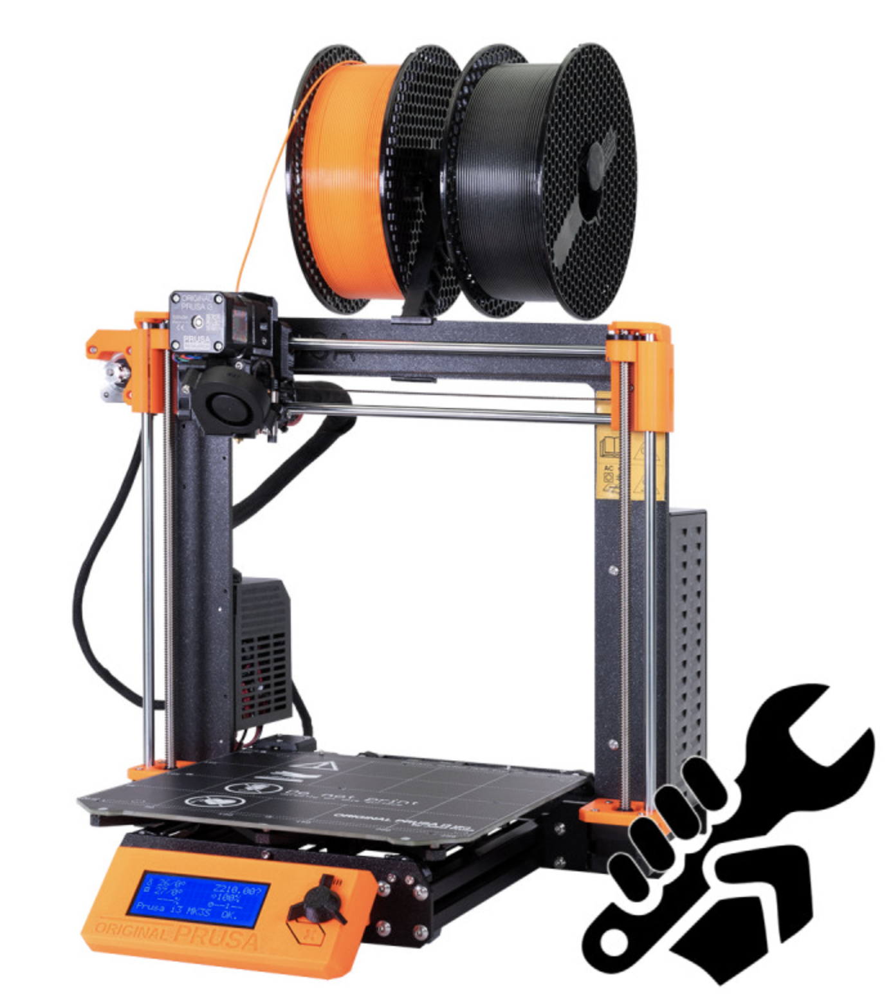
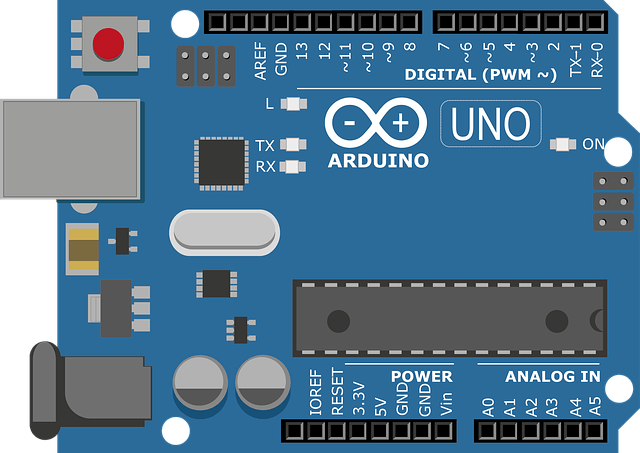
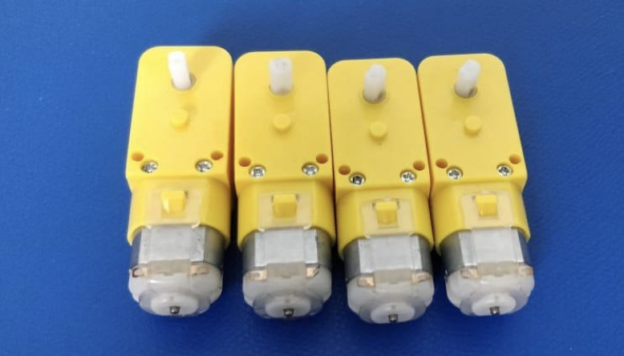
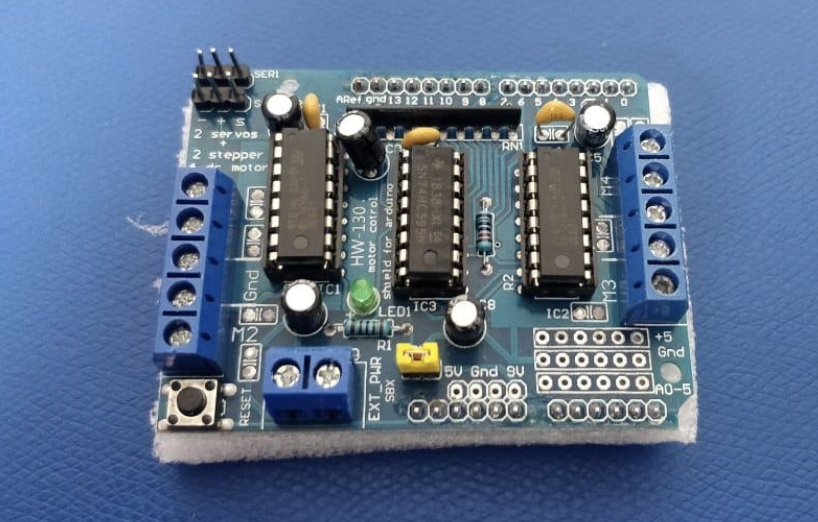
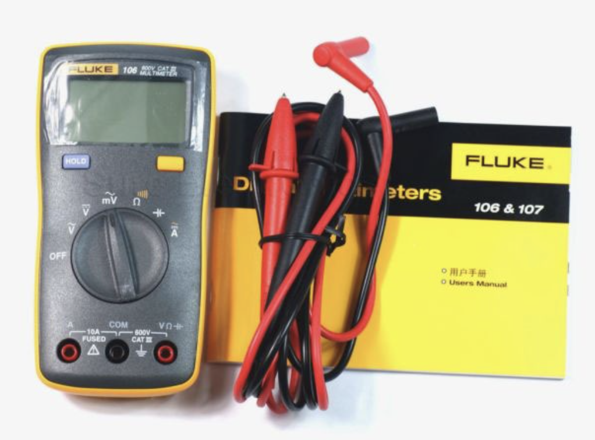
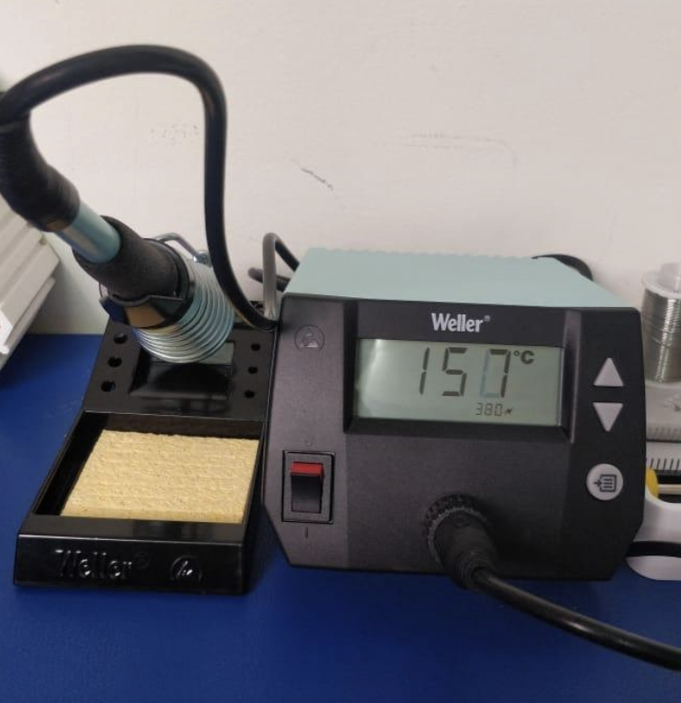
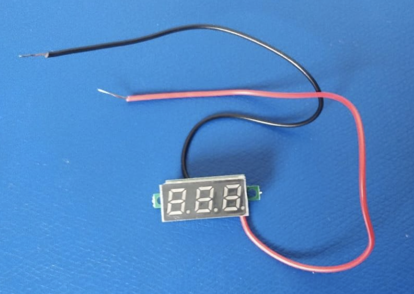
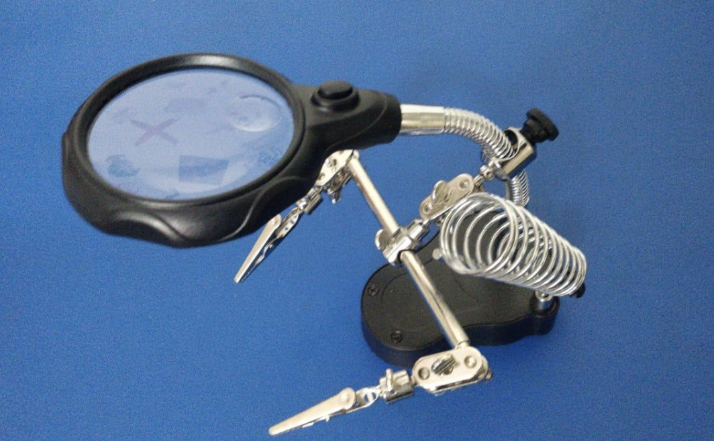
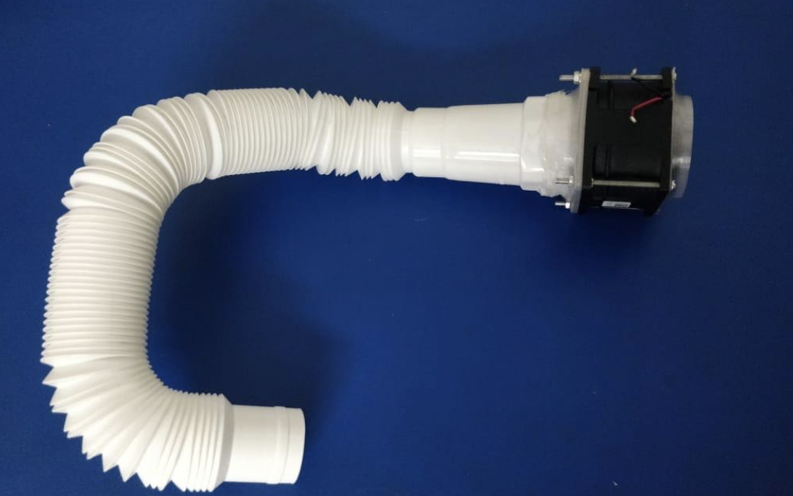

## Preparing Your Environment

| S. No. |Items        |   Link        | Reference |
| ------------- |:-------------:| -----:| -----:|
| 1 | Prusa i3 MK3S | [Buy](https://shop.prusa3d.com/en/3d-printers/180-original-prusa-i3-mk3-kit.html) | | 
| 2 | Arduino Uno | [Buy](https://robu.in/product/original-arduino-uno-rev3/) |  |
| 3 | 300 RPM BO Motor-Straight | [Buy](https://robu.in/product/300-rpm-bo-motor-straight/) | | 
| 4 | L293D Motor Driver  | [Buy](https://robu.in/product/l298p-motor-driver-shield-for-arduino/) |  | 
| 5 | Jetson Nano 4GB(Development)| [Buy](https://www.tannatechbiz.com/brand/nvidia/nvidia-development-board.html) |  |
| 6 | Jetson AGX Xavier(Production) ) | [Buy](https://www.tannatechbiz.com/brand/nvidia/nvidia-development-board.html) |  |
| 7 | Arduino Power Supply | [Buy](https://robu.in/product/orange-5v-3a-power-supply-adapter-charger-with-5-5mm-dc-plug/) | |
| 8 | Cable for Arduino UNO | [Buy](https://robu.in/product/cable-for-arduino-uno-mega-usb-a-to-b-1m/) | | 
| 9 | Digital Multimeter | [Buy](https://www.amazon.in/Fluke-106-Sized-Digital-Multimeter/) | | 
| 10 | Soldering Workstation | [Buy](https://sumitron.com/product/hakko-fx-801-soldering-station/) | |
| 11 | Soldering Mat | [Buy](https://www.amazon.in/Scout-Insulation-Silicone-Magnetic-Soldering/dp/B07W98FT6D/) | |
| 12 | SD Card 128 GB | [Buy](https://www.amazon.in/SanDisk-microSDXC-Memory-Adapter-SDSQUAR-128G-GN6MA/dp/B073JYC4XM/) | | 
| 13 | Noctua Fans | [Buy](https://www.primeabgb.com/online-price-reviews-india/nocuta-nf-a14-ippc-3000-pwm-140mm-pwm-aao-frame-technology-and-sso2-bearing-fan/) | | 14 | USB C Power Cable | [Buy]() | | 

## Prusa i3 MKS(3D Printer)

Prusa i3 uses 3D printing filament as feedstock to make parts. It is simple to use and consistently produced good-quality prints. Prusa i3 comes with a brand new SuperPINDA probe for improved first layer calibration, added high-quality Misumi bearings and various useful design tweaks to make the printer easier to assemble and maintain. This red-and-black printer measures 15 by 19.7 by 22 inches (HWD), excluding the spool and the spool holder, which sit atop the printer. It is considerably larger than the Original Prusa Mini, which measures 14.6 by 13 by 15 inches (HWD). The i3 MK3S also has a larger print volume, 9.8 by 8.3 by 7.9 inches, compared with the 7-by-7-by-7-inch print volume of the Prusa Mini.

## Arduino Uno 

The Arduino Uno R3 with Cable is a microcontroller board based on the ATmega328. It has 14 digital input/output pins (of which 6 can be used as PWM outputs); 6 analog inputs, a 16 MHz ceramic resonator, a USB connection, a power jack, an ICSP header, and a reset button.

## 300 RPM BO Motor-Straight 

The 300 RPM BO Motor Plastic Gear Motor – BO series straight motor gives good torque and rpm at lower operating voltages, which is the biggest advantage of these motors.
Small shaft with matching wheels gives an optimized design for your application or robot. Mounting holes on the body & light weight makes it suitable for in-circuit placement. This motor can be used with 69mm Diameter Wheel for Plastic Gear Motors and 87mm Diameter Multipurpose Wheel for Plastic Gear Motors.

## L293D Motor Driver

The L293D Motor Driver/Servo Shield for Arduino is probably one of the most versatile on the market and features 2 servo and 4 motor connectors for DC or stepper motors.
This Arduino compatible motor Driver shield is a full-featured product that it can be used to drive 4 DC motor or two 4-wire steppers and two 5v servos. It drives the DC motor and stepper with the L293D, and it drives the servo with Arduino pin9 and pin10.
The shield contains two L293D motor drivers and one 74HC595 shift register. The shift register expands 3 pins of the Arduino to 8 pins to control the direction of the motor drivers. The output enables the L293D is directly connected to the PWM outputs of the Arduino.

## Fluke 106 Multimeter

## Weller WE 1010NA soldering Workstation

## NEO-6M GPS Module with EPROM

##  MT3608 2A Max DC-DC Step Up Power Module Booster Power Module 

The MT3608 2A Max DC-DC Step Up Power Module Booster Power Module is a low-cost module that can step-up a 2 to 24V input voltage up to a 5 to 28V output at up to 2A.

## 0.28 Inch 0-100V Three Wire DC Voltmeter

This is a tiny and compact digital voltmeter with a red LED Display. The 0 to 100 V 0.28-inch Digital Voltage Tester DC VOLTMETER requires only a few minutes of configuration and is as simple as directly connecting wires to the source you want to measure and seeing the LED blink

## TE-801 Multi-function LED Magnifier PCB Soldering iron Stand Holder Table Magnifying glass 35X 12X w/ 2-LED Light 

## Custom Fume extractor 

## Jetson Nano

