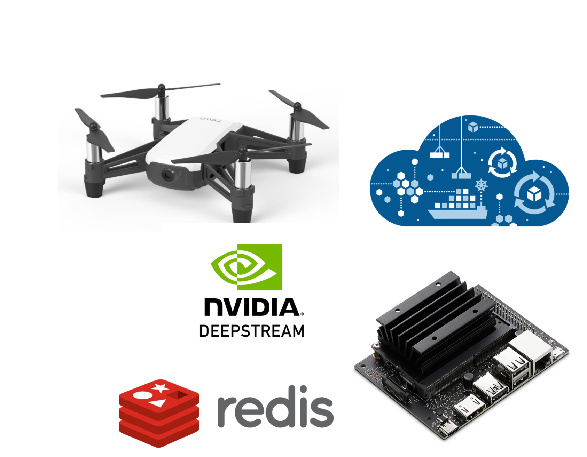

Building an Intelligent Fire Detection and Analytics using Drone, Jetson Nano and NVIDIA DeepStream



## Hardware Requirement

- DJI Tello Drone
- NVIDIA Jetson Nano 2GB
- NVIDIA Jetson Nano SD Card
- WiFi Module(Tenda)
- 5V / 4A Power Supply
- NVIDIA DeepStream 6.0

## Setting up Drone

- Power-on Drone 
- Configure it as a hotspot
- Connect Jetson to Drone via hotspot

## Setting up Docker on Jetson Nano

- Install Docker
- Configure Docker with GPU


## Python Script to control Drone via Python

### Pre-requisite:

- Linux System( Desktop or Edge device)
- Python3
- Tello Mobile app
- Press the “Power” button of Tello once. Once it start blinking, open up Tello Android app to discover Tello drone. Open settings and configure WiFi settings like username and password. Connect your laptop to the Tello WiFI network. Follow the below steps to connect via Python script.

### Install using pip

```
pip install djitellopy
```

For Linux distributions with both python2 and python3 (e.g. Debian, Ubuntu, …) you need to run

```
pip3 install djitellopy
```

See djitellopy.readthedocs.io for a full reference of all classes and methods available.

## Step 1. Connect, TakeOff, Move and Land

The below Python script allows you to connect to the drone, take off, make some movement — Left and Right and then Land smoothly.

```
from djitellopy import Tello

tello = Tello()

tello.connect()
tello.takeoff()

tello.move_left(100)
tello.rotate_counter_clockwise(90)
tello.move_forward(100)

tello.land()
```
		
## Step 2. Take a Picture

```
import cv2
from djitellopy import Tello
tello = Tello()
tello.connect()
tello.streamon()
frame_read = tello.get_frame_read()
tello.takeoff()
cv2.imwrite("picture.png", frame_read.frame)
tello.land()
```

## Step 3. Recording a Video

```
import time, cv2
from threading import Thread
from djitellopy import Tello
tello = Tello()
tello.connect()
keepRecording = True
tello.streamon()
frame_read = tello.get_frame_read()
def videoRecorder():
    # create a VideoWrite object, recoring to ./video.avi
   
    height, width, _ = frame_read.frame.shape
    video = cv2.VideoWriter('video.avi', cv2.VideoWriter_fourcc(*'XVID'), 30, (width, height))
while keepRecording:
        video.write(frame_read.frame)
        time.sleep(1 / 30)
video.release()
# we need to run the recorder in a seperate thread, otherwise blocking options
#  would prevent frames from getting added to the video
recorder = Thread(target=videoRecorder)
recorder.start()
tello.takeoff()
tello.move_up(100)
tello.rotate_counter_clockwise(360)
tello.land()
keepRecording = False
recorder.join()
```

## Step 4. Control the drone using Keyboard

```
from djitellopy import Tello
import cv2, math, time
tello = Tello()
tello.connect()
tello.streamon()
frame_read = tello.get_frame_read()
tello.takeoff()
while True:
    # In reality you want to display frames in a seperate thread. Otherwise
    #  they will freeze while the drone moves.
   
    img = frame_read.frame
    cv2.imshow("drone", img)
key = cv2.waitKey(1) & 0xff
    if key == 27: # ESC
        break
    elif key == ord('w'):
        tello.move_forward(30)
    elif key == ord('s'):
        tello.move_back(30)
    elif key == ord('a'):
        tello.move_left(30)
    elif key == ord('d'):
        tello.move_right(30)
    elif key == ord('e'):
        tello.rotate_clockwise(30)
    elif key == ord('q'):
        tello.rotate_counter_clockwise(30)
    elif key == ord('r'):
        tello.move_up(30)
    elif key == ord('f'):
        tello.move_down(30)
tello.land()
```


 
- Fly drone via ajeetraina/flydrone-arm64
- Take pictures via ajeetraina/dronecapture-arm64
- Record video via ajeetraina/dronerecord-arm64


## Deepstream Setup

This post assumes you have a fully functional Jetson device. If not, you can refer the documentation [here](https://docs.nvidia.com/jetson/jetpack/install-jetpack/index.html).

### 1. Install System Dependencies

```sh
sudo apt install \
libssl1.0.0 \
libgstreamer1.0-0 \
gstreamer1.0-tools \
gstreamer1.0-plugins-good \
gstreamer1.0-plugins-bad \
gstreamer1.0-plugins-ugly \
gstreamer1.0-libav \
libgstrtspserver-1.0-0 \
libjansson4=2.11-1
```

### 2. Install Deepstream

#### DeepStream 5.1

Download the DeepStream 5.1 Jetson Debian package `deepstream-5.1_5.1.0-1_arm64.deb`, to the Jetson device from [here](https://developer.nvidia.com/deepstream-getting-started). Then enter the command:

```sh
sudo apt install deepstream-5.1_5.1.0-1_arm64.deb
```

#### DeepStream 6.0

### Install Dependencies

Enter the following commands to install the prerequisite packages:

```
$ sudo apt install \
libssl1.0.0 \
libgstreamer1.0-0 \
gstreamer1.0-tools \
gstreamer1.0-plugins-good \
gstreamer1.0-plugins-bad \
gstreamer1.0-plugins-ugly \
gstreamer1.0-libav \
libgstrtspserver-1.0-0 \
libjansson4=2.11-1
```

### Install librdkafka (to enable Kafka protocol adaptor for message broker)

Clone the librdkafka repository from GitHub:

```
$ git clone https://github.com/edenhill/librdkafka.git
```

### Configure and build the library:

```
$ cd librdkafka
$ git reset --hard 7101c2310341ab3f4675fc565f64f0967e135a6a
./configure
$ make
$ sudo make install
```

### Copy the generated libraries to the deepstream directory:

```
$ sudo mkdir -p /opt/nvidia/deepstream/deepstream-6.0/lib
$ sudo cp /usr/local/lib/librdkafka* /opt/nvidia/deepstream/deepstream-6.0/lib
```

### Install latest NVIDIA BSP packages

Open the apt source configuration file in a text editor, for example:

```
$ sudo vi /etc/apt/sources.list.d/nvidia-l4t-apt-source.list
```

Change the repository name and download URL in the deb commands shown below:

```
deb https://repo.download.nvidia.com/jetson/common r32.6 main
deb https://repo.download.nvidia.com/jetson/<platform> r32.6 main
```

<platform> identifies the platform’s processor:
t186 for Jetson TX2 series
t194 for Jetson AGX Xavier series or Jetson Xavier NX
t210 for Jetson Nano or Jetson TX1

For example, if your platform is Jetson Xavier NX:

```
deb https://repo.download.nvidia.com/jetson/common r32.6 main
deb https://repo.download.nvidia.com/jetson/t194 r32.6 main
```
    
Save and close the source configuration file.

Enter the commands:

```
$ sudo apt update
```

    Install latest NVIDIA V4L2 Gstreamer Plugin using the following command:

```
    $ sudo apt install --reinstall nvidia-l4t-gstreamer
```
    
If apt prompts you to choose a configuration file, reply Y for yes (to use the NVIDIA updated version of the file).

### Install latest L4T MM and L4T Core packages using following commands:

```
    $ sudo apt install --reinstall nvidia-l4t-multimedia
$ sudo apt install --reinstall nvidia-l4t-core
```
## Note

You must update the NVIDIA V4L2 GStreamer plugin after flashing Jetson OS from SDK Manager.

## Install the DeepStream SDK

Method 1: Using SDK Manager

Select DeepStreamSDK from the Additional SDKs section along with JP 4.6 software components for installation.

Method 2: Using the DeepStream tar package: https://developer.nvidia.com/deepstream_sdk_v6.0.0_jetsontbz2

Download the DeepStream 6.0 Jetson tar package deepstream_sdk_v6.0.0_jetson.tbz2 to the Jetson device.

Enter the following commands to extract and install the DeepStream SDK:

```
$  sudo tar -xvf deepstream_sdk_v6.0.0_jetson.tbz2 -C /
$ cd /opt/nvidia/deepstream/deepstream-6.0
$ sudo ./install.sh
$ sudo ldconfig
```
    
Method 3: Using the DeepStream Debian package: https://developer.nvidia.com/deepstream-6.0_6.0.0-1_arm64deb

Download the DeepStream 6.0 Jetson Debian package deepstream-6.0_6.0.0-1_arm64.deb to the Jetson device. Enter the following command:

```
$ sudo apt-get install ./deepstream-6.0_6.0.0-1_arm64.deb
```

## Ryze Tello Setup

### 1. Installing pip packages

First, we need to install python dependencies. Make sure you have a working build of python3.7/3.8

```sh
sudo apt install python3-dev python3-pip
```

The dependencies needed are the following:

```sh
djitellopy==1.5
evdev==1.3.0
imutils==0.5.3
numpy==1.19.4
opencv-python==4.4.0.46
pycairo==1.20.0
pygame==2.0.1
PyGObject==3.38.0
pynput==1.7.2
python-xlib==0.29
redis==3.5.3
six==1.15.0
```

You can either install them with pip command or use the requirements.txt file. Whatever sails your boat :)

```sh
# For individial packages
pip3 install <packagename>

# For requirements.txt
pip3 install -r requirements.txt
```
