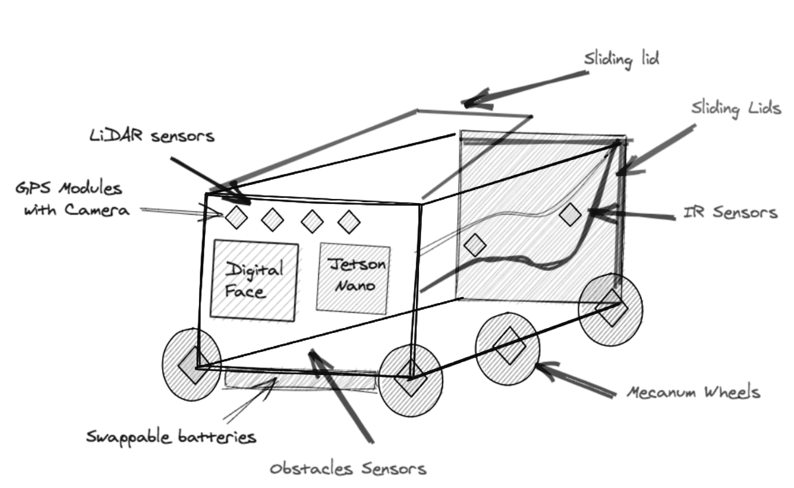

## What is it?

A CherryBot is an autonomous robotic system powered with production-ready System on Module(SOM) NVIDIA Jetson Nano board, a low-powered AI deployed as Edge device, a sensor suite that includes multiple cameras, GPS and swappable batteries.It is an autonomous delivery robot which picks up and delivers swags and food items within a conference, campus or a roughly 5-6 square kilometers area centered around university premises. The goal is to allow the robot to traverse a given conference and campus area delimited by coordinates on a GPS receiver, detect and avoid obstacles in its path, thereby distributing swags and food items using Deep Learning algorithm.

## What is it good for?

CherryBot Robotic Platform is a game-changing educational robot built to unlock the potential in every learner. It provides users with an in-depth understanding of Artificial Intelligence, IoT Edge devices (such as Jetson Nano and Xavier)

## What is it not good for?

This is just a prototype and not to be used for production

## Where should I go next?

* [Getting Started](/docs/getting-started/): Get started with $project

